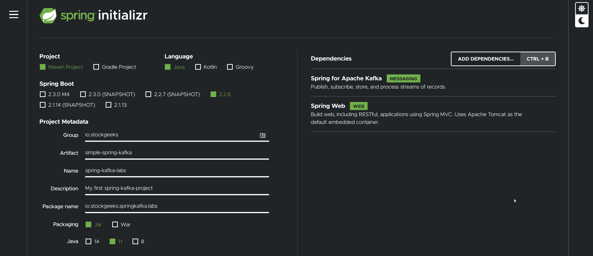

# Create a spring boot application

In this lab you will create a Spring Boot Application as a starting point, in order to do that open a browser and navigate to [https://start.spring.io](https://start.spring.io), you should see this website displayed below. 

> Try to use the same versions as we recommend on the labs but don't worry too much if the version doesn't exactly match the version you see in this guide, Spring Boot evolves fast but most likely small divergence in the versions will not break compatibility with the exercises here, we will update the exercises every time this happens. 

Spring Boot Initializer Web Site: 

Fill in the fields with the following values, leave any fields not mentioned here with the default values: 

Project: `Maven Project`

Language: `Java`

Spring Boot: `2.2.6`

Project Metadata:

    Group: io.resona
    Artifact: simple-spring-kafka
    Options: 
        Name: spring-kafka-labs
        Description: My spring-kafka-project
        Package name: io.resona.springkafka.labs
        Packaging: Jar
        Java: 11

Dependencies: 

    Spring for Apache Kafka
    Spring Web    

Click the green `Generate` button and download the project. 

Extract to your prefered working directory location and optionally import the project in your favorite IDE if you want to explore it.

# Build and run the project

 - Open a command line, navigate to the place where you extracted the generated project and bulild the project using Maven: `mvn clean package`

 - Once the project finish building, run it: `mvn springboot:run` wait for the starting message.

 Congratulations you now have a Spring Boot Application Running in your local developer Machine.

