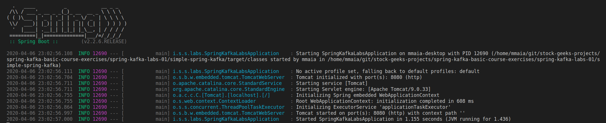

# Create a Spring Boot Application

If you followed the lab exercise you should have a Spring Boot Application in your working directory with the following specifications.

Project: `Maven Project`

Language: `Java`

Spring Boot: `2.2.6`

Project Metadata:

    Group: io.resona
    Artifact: simple-spring-kafka
    Name: spring-kafka-labs
    Description: My spring-kafka-project
    Package name: io.resona.springkafka.labs
    Packaging: Jar
    Java: 11

Dependencies: 

    Spring for Apache Kafka
    Spring Web    


# Build and run the project

 - Open a command line and navigate to the place where you extracted the generated project and bulild the project: `mvn clean package`

 - Once the project finish building run it: `mvn spring-boot:run` wait for the start message, you whould see a terminal like this: 



You should have a spring-boot application now running on port 8080. 

The most important parts to check up to this point is the pom.xml file of the project, specifically, the spring-kafka and web dependencies. 

```
<dependency>
    <groupId>org.springframework.boot</groupId>
    <artifactId>spring-boot-starter-web</artifactId>
</dependency>
<dependency>
    <groupId>org.springframework.kafka</groupId>
    <artifactId>spring-kafka</artifactId>
</dependency>
```

The spring-boot-starter-web dependency automatically bundles a Tomcat instance and bring the Spring Web MVC libraries. 

The spring-kafka dependency brinks spring-kafka and the kafka-client libraries by transient dependency.

To stop the running application you can select the terminal window where it's running and hit `CTR + C`

Congratulations you're done with this lab!
