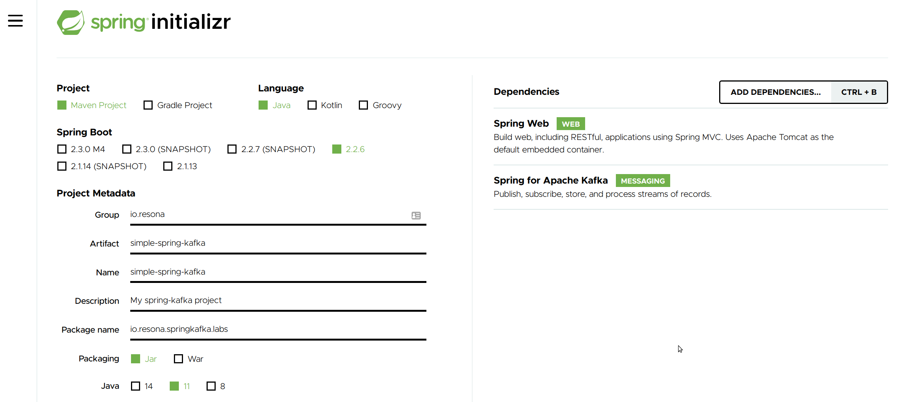

# Create a Spring Boot Application

In this lab you will create a Spring Boot Application wich will be used in other exercises as a starting point for tasks and hands on exercises. 

## Goal 

The goal of this lab is to have a running Spring Boot Application with `Spring for Apache Kafka and Spring Web` configured.

## Task - Create a new Spring Boot Application

Navigate to [https://start.spring.io](https://start.spring.io)

Fill in the form and click Generate:

## Task - Extract the generated Application to working directory

We added the extracted content to a folder in this trainning repo, check the VSCode overview in the image below:

## Task - Build and run the project

 Build the project using Maven, same directory where the `pom.xml` is: `mvn clean package`

 Run it: `mvn spring-boot:run` 

