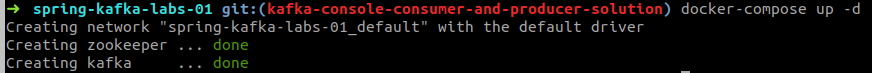
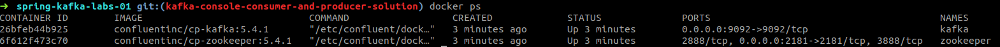
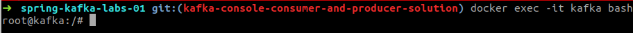
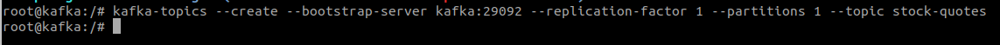
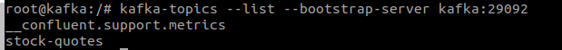
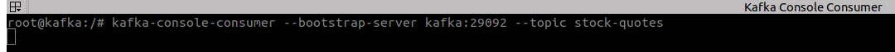
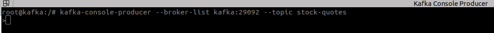
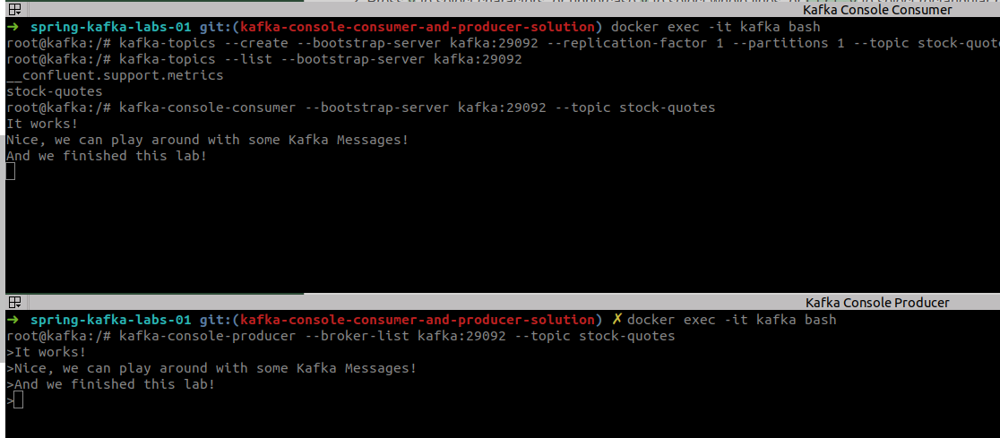

# Lab: Run a Console Producer and Consumer - Solution


### Goal 

In this lab we will use the built in console Kafka Consumer and Kafka Producer to send and receive simple messages from Kafka. 

### Exercise

## Task - Start Local Kafka

Start the docker-compose configuration for this exercise: `docker-compose up -d`



## Task - Check Local Kafka

List the running containers: `docker ps`



## Task - Enter terminal Kafka running Docker container

Enter Kafka running docker container: `docker exec -it kafka bash`



## Task - Create a Kafka Topic

Create a Kafka topic: 

```
kafka-topics --create --bootstrap-server kafka:29092 --replication-factor 1 --partitions 1 --topic stock-quotes
```



Check the topics: 

```
kafka-topics --list --bootstrap-server kafka:29092
```



## Task - Create a Console Consumer

- Create a simple console Kafka Consumer.

```
kafka-console-consumer --bootstrap-server kafka:29092 --topic stock-quotes
```



## Task - Create a Console Producer

- Create a Simple console Kafka Producer.

```
kafka-console-producer --broker-list kafka:29092 --topic stock-quotes
```



Sending some messages: 

